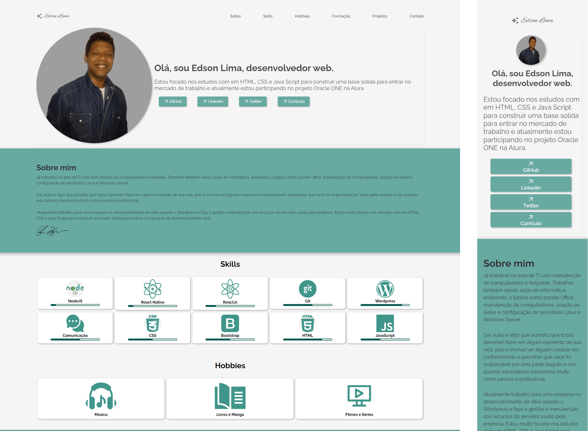

# Challenge Oracle One - FrontEnd Portfólio

	
	
	

## Objetivo: Construir um site de portfolio para apresentar os projetos desenvolvidos

### Link das Demos:

- [Codificador de Textos ](https://edsonllima.github.io/projetos/codificador-one/)
- [Portfolio](https://edsonllima.github.io/)

---

	

## Meu projeto

Comecei o desenvolvimento pelo layout HTML e CSS e depois JavaScript para a validação.

Durante o processo de desenvolvimento passei vários momentos sem saber o que fazer, não por que o projeto era difícil mais sim por minha falta de conhecimento sobre o que usar para chegar no meu objetivo e nesse ponto as aulas, a comunidade e as dicas da Alura ajudaram muito.

Fiz algumas alterações no layout para deixar mais colorido e com algumas seções um pouco diferentes do layout original.

Apliquei o CSS usando BEM para manter um padrão e facilitar a manutenção, lembrando que essa foi minha primeira vez usando esse padrão que aprendi no curso.

Fiz algumas validações nos inputs do formulário para deixar mais otimizada as mensagens de erro. Futuramente vou fazer um tratamento para melhora o código usado mais o resutlado final gosttei muito pois aprendi a usar alguns recursos internos o INPUT como checar os recursos do _validity_

Ao final do projeto eu estava me sentindo muito mais a vontade com o uso do CSS e a e como a forma que usei o BEM me possibilitou de fazer diversas altgerações de maneira rápida sem precisar procuirar muito onde cada código css estava o que aumentou muita minha produtividade nessa parte.

---

### Como executar

- Baixe o projeto ou use o Git Clone.
- Após isso apenas execute o arquivo Index.html

### O que aprendi com esse projeto:

- Que errar faz parte do processo;
- A usar o padrão BEM para o CSS;
- Seguir certos padrões facilita a refatoração
- Estou muito mais familiarizado no uso do Git e GitHub
- Refatorar ajuda a melhorar o código;
- Pesquisar sempre que tiver dúvidas;
- Pedir ajuda quando estiver perdido: a comunidade ONE no Discord sempre está pronta para se ajudar.;
- É uma sensação incrivel terminar um desafio e empolgante.

### Minhas referências:

- Curso Online HTML5 e CSS3 parte 1 - 4: a primeira página da Web | Alura
- Curso Online Acessibilidade web parte 1: tornando seu front-end inclusivo | Alura
- Curso Online JavaScript na Web: validação de Formulários e HTML5 | Alura
- Curso Online Flexbox: posicione elementos na tela | Alura
- Curso Online CSS Grid: simplificando layouts | Alura

##
